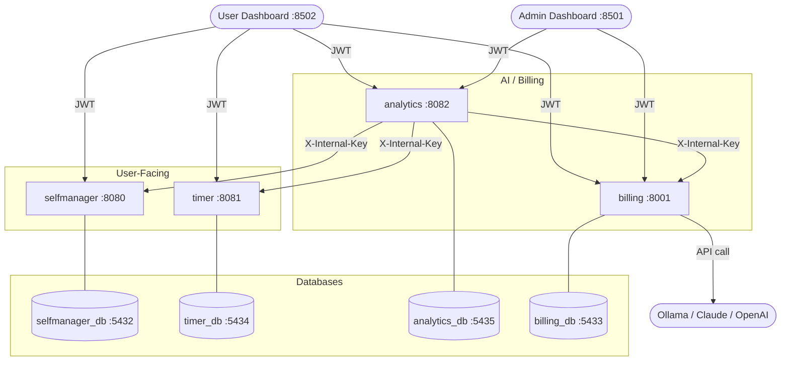
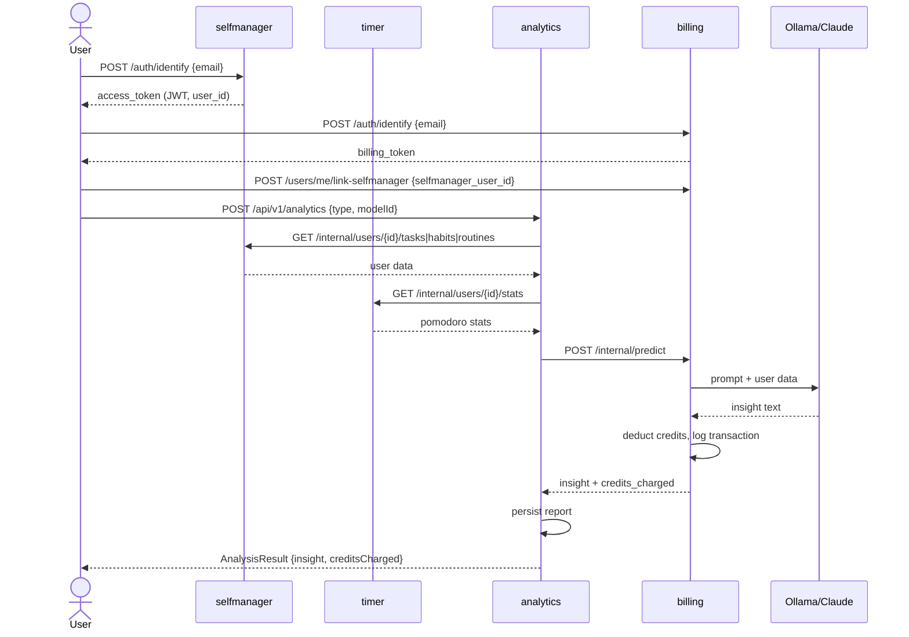

# ProductiveSocial — Architecture Overview

## What it does

Users track their work (tasks, habits, routines, focus sessions), and the system uses AI to analyze their productivity and charge credits for it.

---

## Services

### `psocial_selfmanager` (Kotlin/Ktor, port 8080)
The core user-facing service. Manages:
- **Users** — identified by email only, no password
- **Tasks** — with priority, time tracking, completion logs
- **Habits** — daily/weekly habits with type and recurrency
- **Routines** — structured routines with recurrency
- **Projects** — grouping of work

Exposes internal endpoints so `psocial_analytics` can pull per-user data.

### `psocial_timer` (Kotlin/Ktor, port 8081)
Pomodoro focus session tracker. Records work/break cycles linked to tasks or habits. Exposes an internal endpoint so analytics can pull per-user stats.

### `psocial_analytics` (Kotlin/Ktor, port 8082)
AI analysis service. Pulls data from selfmanager and timer, sends it to billing for LLM inference, stores the resulting insight, and presents reports to users and admins.
- Regular users can trigger analysis and read their own reports
- Admins can view all users' reports and aggregate stats

### `psocial_billing_service` (Python/FastAPI, port 8001)
Handles:
- **Credits** — users have a balance, AI calls cost credits
- **ML models** — register scikit-learn (`.pkl`) or LLM models
- **Predictions** — run sklearn inference or call Ollama/Claude/OpenAI, deduct credits
- **Transactions** — full audit log of credit charges/refunds

### `psocial_dashboard` (Streamlit, port 8501)
**Admin UI.** Login restricted to users with `is_admin=true`. Pages:
- **Overview** — system-wide billing stats (users, predictions, credits charged/deposited, active models)
- **Users** — list all users, activate/deactivate, top up credits
- **Models** — register and delete ML/LLM models
- **Predictions** — view all predictions system-wide
- **Analytics** — view all AI reports by type and by user, delete user reports

### `psocial_user_dashboard` (Streamlit, port 8502)
**User UI.** Login open to any registered user. Pages:
- **Productivity** — view tasks, habits, and routines from selfmanager
- **Focus** — pomodoro settings and session history from timer
- **Analysis** — trigger AI analysis, view previous reports
- **Credits** — current balance, email, and transaction history

---

## Docker Setup

All services run via Docker Compose (`docker-compose.yml` in the project root).

```
docker-compose up --build   # build and start everything
docker-compose down         # stop all services
docker-compose logs -f <service>  # tail logs for a service
```

Each Kotlin service uses a multi-stage Dockerfile: Gradle build stage → `eclipse-temurin:17-jre` runtime.  
Python services use `python:3.12-slim`.

**Colima** is the recommended Docker runtime on macOS. Start with enough memory for Kotlin builds:
```
colima start --memory 6 --cpu 4
```

---

## Authentication

### Client → Services (JWT)
- Login via `POST /api/v1/auth/identify` with email only
- selfmanager and timer share the same JWT secret → one token works on both
- analytics accepts selfmanager/timer JWTs directly
- billing has its own JWT (separate user DB, separate UUIDs)
- On login, the dashboard decodes the selfmanager JWT to extract `user_id` and calls `POST /api/v1/users/me/link-selfmanager` to link the billing account — required for LLM predictions

### Service → Service (Internal Key)
- `X-Internal-Key` header with a shared secret
- Used for: analytics → selfmanager, analytics → timer, analytics → billing
- No JWT involved — simpler, no user context needed

---

## Data Flow — AI Analysis (end to end)

```
User / Dashboard
  └─ POST /api/v1/analytics  (JWT)
       └─ psocial_analytics
            ├─ GET /internal/users/{id}/tasks      (X-Internal-Key)
            ├─ GET /internal/users/{id}/habits     (X-Internal-Key)
            ├─ GET /internal/users/{id}/routines   (X-Internal-Key)
            │    └─ selfmanager
            ├─ GET /internal/users/{id}/stats      (X-Internal-Key)
            │    └─ timer → returns pomodoro session stats
            └─ POST /internal/predict              (X-Internal-Key)
                 └─ billing
                      ├─ loads model config
                      ├─ calls Ollama / Claude / OpenAI
                      ├─ deducts credits from user balance
                      ├─ logs transaction
                      └─ returns insight text + credits charged
  └─ analytics stores report, returns AnalysisResult
```

---

## Data Flow — Mermaid Diagram



---

## User Flow — Login & Analysis



---

## Databases

Each service owns its own PostgreSQL database. No shared tables — services only communicate via HTTP.

| Service      | Container            | Host Port |
|--------------|----------------------|-----------|
| selfmanager  | psocial_selfmanager_db | 5432    |
| billing      | psocial_billing_db   | 5433      |
| timer        | psocial_timer_db     | 5434      |
| analytics    | psocial_analytics_db | 5435      |

---

## Timer Endpoints

All endpoints under `/api/v1/pomodoro` require a Bearer JWT.

| Method | Path | Description |
|--------|------|-------------|
| `POST` | `/api/v1/auth/identify` | Find-or-create user, return JWT |
| `GET` | `/api/v1/pomodoro/settings` | Get user's pomodoro settings |
| `PUT` | `/api/v1/pomodoro/settings` | Update pomodoro settings |
| `POST` | `/api/v1/pomodoro/sessions` | Create a new focus session (auto-starts first Work interval) |
| `GET` | `/api/v1/pomodoro/sessions` | List all sessions (optional `?entityType=Task&entityId=1`) |
| `GET` | `/api/v1/pomodoro/sessions/{id}` | Get a specific session with all intervals |
| `POST` | `/api/v1/pomodoro/sessions/{id}/intervals/start` | Start the next interval (Work → ShortBreak → LongBreak) |
| `POST` | `/api/v1/pomodoro/sessions/{id}/intervals/{intervalId}/complete` | Mark an interval as completed |
| `PATCH` | `/api/v1/pomodoro/sessions/{id}/pause` | Pause an active session |
| `PATCH` | `/api/v1/pomodoro/sessions/{id}/resume` | Resume a paused session |
| `PATCH` | `/api/v1/pomodoro/sessions/{id}/complete` | Mark session as completed |
| `DELETE` | `/api/v1/pomodoro/sessions/{id}/abandon` | Abandon a session |
| `POST` | `/api/v1/pomodoro/sync` | Sync offline sessions from KMP clients |
| `GET` | `/internal/users/{id}/stats` | Aggregated stats for analytics (X-Internal-Key) |

---

## Billing Endpoints

Auth and user endpoints are unauthenticated or require a billing Bearer JWT. Internal endpoints require `X-Internal-Key`. Admin endpoints require a billing JWT with `is_admin=true`.

| Method | Path | Description |
|--------|------|-------------|
| `POST` | `/api/v1/auth/identify` | Find-or-create billing account by email, return JWT |
| `POST` | `/api/v1/auth/refresh` | Rotate refresh token, return new token pair |
| `GET` | `/api/v1/users/me` | Get billing profile (credits balance, selfmanager link) |
| `POST` | `/api/v1/users/me/link-selfmanager` | Link billing account to a selfmanager user ID |
| `POST` | `/api/v1/users/me/deposit` | Add credits to own balance |
| `GET` | `/api/v1/users/me/transactions` | Full credit transaction history |
| `GET` | `/api/v1/models` | List all active ML/LLM models |
| `GET` | `/api/v1/models/{id}` | Get a single model's details |
| `POST` | `/api/v1/models` | Register a new model (LLM or sklearn) |
| `POST` | `/api/v1/models/{id}/upload` | Upload a sklearn .pkl file |
| `DELETE` | `/api/v1/models/{id}` | Delete a model |
| `GET` | `/api/v1/predictions` | List the user's prediction history |
| `GET` | `/api/v1/predictions/{id}` | Get a single prediction with output |
| `GET` | `/api/v1/predictions/analytics` | User's prediction stats by model and by day |
| `POST` | `/api/v1/internal/predict` | Run prediction on behalf of a user by selfmanager_user_id (X-Internal-Key) |
| `GET` | `/api/v1/internal/users/{selfmanager_user_id}/balance` | Check credit balance by selfmanager ID (X-Internal-Key) |
| `POST` | `/api/v1/internal/users/make-admin` | Bootstrap: promote a user to admin by email (X-Internal-Key) |
| `GET` | `/api/v1/admin/users` | List all billing users with balances |
| `POST` | `/api/v1/admin/users/{id}/deposit` | Deposit credits into any user's account (admin only) |
| `PATCH` | `/api/v1/admin/users/{id}/toggle-active` | Activate or deactivate a user |
| `GET` | `/api/v1/admin/predictions` | All predictions system-wide |
| `GET` | `/api/v1/admin/analytics` | System totals: users, predictions, credits charged/deposited, active models |

---

## End-to-End User Journey

Full flow for a new user from registration through productivity analysis.

| Step | Service | Action | Result |
|------|---------|--------|--------|
| 1 | selfmanager | `POST /api/v1/auth/identify` with email | User created, JWT issued |
| 2 | selfmanager | `POST /api/v1/sync` with project + tasks + habits + routines | All entities created, server IDs returned via `idMappings` |
| 3 | timer | `POST /api/v1/auth/identify` | Timer JWT issued |
| 3 | timer | `POST /api/v1/pomodoro/sessions` + complete intervals | Focus sessions logged |
| 4 | billing | `POST /api/v1/auth/identify` | Billing account created, 100 welcome credits deposited |
| 4 | billing | `POST /api/v1/users/me/link-selfmanager` | Billing account linked to selfmanager user ID (done automatically on dashboard login) |
| 5 | analytics | `POST /api/v1/analytics` | Pulls tasks/habits/routines + pomodoro stats, sends to billing LLM, stores insight |
| 6 | analytics | `GET /api/v1/analytics` | User reads their stored reports |
| 6 | billing | `GET /api/v1/users/me/transactions` | User sees credit charges and current balance |

---

## Analytics Endpoints

User endpoints require a selfmanager/timer Bearer JWT. Admin endpoints additionally require the caller's email to be in the `ADMIN_EMAILS` env var. Internal endpoints require `X-Internal-Key`.

| Method | Path | Description |
|--------|------|-------------|
| `POST` | `/api/v1/analytics` | Trigger LLM analysis (pulls selfmanager + timer data, charges credits, stores report) |
| `GET` | `/api/v1/analytics` | List the authenticated user's stored reports (newest first) |
| `GET` | `/api/v1/admin/stats` | Totals: users, reports, credits charged, breakdown by analysis type |
| `GET` | `/api/v1/admin/users` | All users with report counts |
| `GET` | `/api/v1/admin/reports` | All reports across all users |
| `GET` | `/api/v1/admin/users/{userId}/reports` | All reports for a specific user |
| `DELETE` | `/api/v1/admin/users/{userId}/reports` | Delete all reports for a specific user |
| `GET` | `/internal/users/{userId}/stats` | Internal: user report stats for service-to-service use (X-Internal-Key) |

---

## Selfmanager Endpoints

Auth endpoints are unauthenticated. All data endpoints require a Bearer JWT — `userId` is extracted from the token. Internal endpoints require `X-Internal-Key`.

| Method | Path | Description |
|--------|------|-------------|
| `POST` | `/api/v1/auth/identify` | Find-or-create user by email, return JWT + refresh token |
| `POST` | `/api/v1/auth/refresh` | Rotate refresh token, return new token pair |
| `POST` | `/api/v1/auth/logout` | Revoke a single refresh token (this device) |
| `POST` | `/api/v1/auth/logout-all` | Revoke all refresh tokens for the user |
| `POST` | `/api/v1/sync` | Sync offline creates/updates/deletes for projects, tasks, habits, routines |
| `GET` | `/api/v1/projects/projects` | List all projects for the authenticated user |
| `POST` | `/api/v1/projects/project` | Create a project |
| `GET` | `/api/v1/projects/project/{id}` | Get a project by ID |
| `PATCH` | `/api/v1/projects/project/{id}` | Update a project |
| `DELETE` | `/api/v1/projects/project/{id}` | Delete a project (cascades to tasks/habits/routines) |
| `GET` | `/api/v1/tasks/tasks` | List all tasks for the authenticated user |
| `POST` | `/api/v1/tasks/task` | Create a task |
| `GET` | `/api/v1/tasks/task/{id}` | Get a task by ID |
| `PATCH` | `/api/v1/tasks/task/{id}` | Update a task |
| `DELETE` | `/api/v1/tasks/task/{id}` | Delete a task |
| `GET` | `/api/v1/habits/habits` | List all habits for the authenticated user |
| `POST` | `/api/v1/habits/habit` | Create a habit |
| `GET` | `/api/v1/habits/habit/{id}` | Get a habit by ID |
| `PATCH` | `/api/v1/habits/habit/{id}` | Update a habit |
| `DELETE` | `/api/v1/habits/habit/{id}` | Delete a habit |
| `GET` | `/api/v1/routines/routines` | List all routines for the authenticated user |
| `POST` | `/api/v1/routines/routine` | Create a routine |
| `GET` | `/api/v1/routines/routine/{id}` | Get a routine by ID |
| `PATCH` | `/api/v1/routines/routine/{id}` | Update a routine |
| `DELETE` | `/api/v1/routines/routine/{id}` | Delete a routine |
| `GET` | `/internal/users/{id}/tasks` | Internal: user tasks for analytics (X-Internal-Key) |
| `GET` | `/internal/users/{id}/habits` | Internal: user habits for analytics (X-Internal-Key) |
| `GET` | `/internal/users/{id}/routines` | Internal: user routines for analytics (X-Internal-Key) |

---

## ML Models — sklearn (.pkl) vs LLM

The billing service supports two model types: `llm` and `sklearn`. Here's why they serve different purposes.

### Why sklearn doesn't fit the current use case

For a `.pkl` model to be useful for productivity analysis, you need:

1. **A dataset** — thousands of rows of structured data like `{tasks_completed, habits_streak, focus_minutes, productivity_score}`
2. **Ground truth labels** — a definition of what "productive" looks like as a number, agreed on and labeled
3. **Training code** — fit the model, tune hyperparameters, validate on a test split
4. **Feature engineering** — convert tasks/habits/routines into a fixed-length numeric vector the model understands

None of that exists yet. Building it would be a research project before writing a single line of product code.

### What sklearn models are good for (future)

Once real user data accumulates, sklearn models become useful for narrower, well-defined tasks:

| Use case | Model type | Data needed |
|---|---|---|
| Predict task completion probability | Logistic regression | Task history with outcomes |
| Classify habit strength (strong / at-risk) | Decision tree | Completion log streaks |
| Estimate focus session duration | Linear regression | Past pomodoro sessions |
| Anomaly detection (unusually low activity) | Isolation Forest | Long-term usage patterns |

These require **months of real user data** before they produce meaningful results.

### Current approach — LLM via Ollama

LLMs handle open-ended productivity analysis without labeled datasets. The billing service calls a local Ollama instance (or Anthropic/OpenAI), passing structured user data as context and returning natural language insights.

**LLM provider options:**

| Provider | Cost | Requires | Notes |
|---|---|---|---|
| Ollama (local) | Free | 8GB+ RAM | Fully offline, llama3/mistral |
| Groq | Free tier | API key | Fast, llama3/mixtral, rate limited |
| Anthropic Claude | Paid | API key | Highest quality |
| OpenAI GPT-4o | Paid | API key | High quality |

The sklearn model support stays in the architecture as a deliberate slot — when sufficient data exists, a trained model can be plugged in via the `/models` upload endpoint with no changes to the rest of the system.
