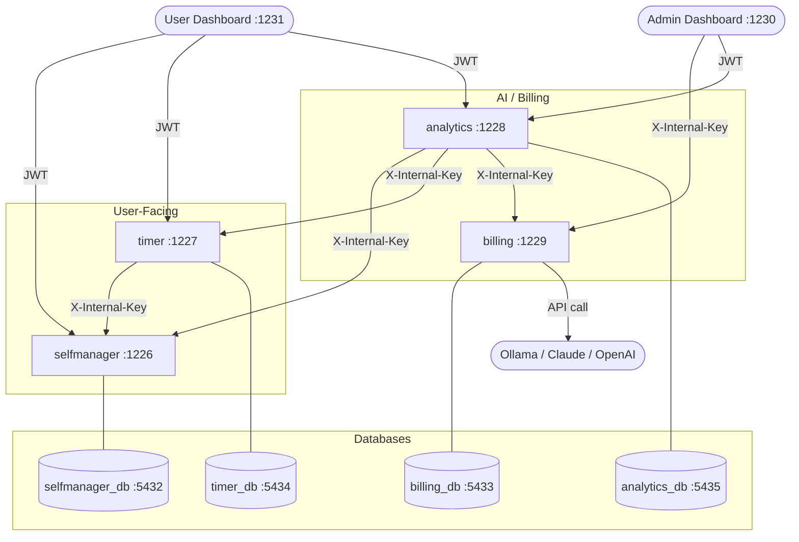
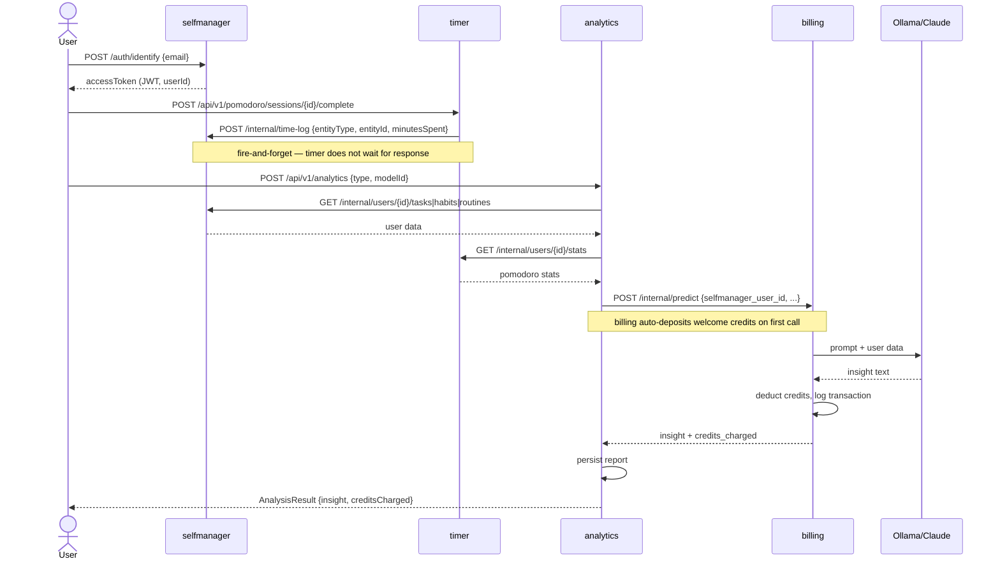

# ProductiveSocial — Architecture Overview

## What It Does

Users track their work — tasks, habits, routines, and focus sessions — and the system uses AI to analyze their productivity and charge credits for it. The backend is split into four services: selfmanager owns the user's data, timer tracks focus sessions, analytics runs AI analysis, and billing handles credits and LLM inference. Two Streamlit dashboards — one for users, one for admins — sit in front of these services.

---

## Services

### `psocial_selfmanager` (Kotlin/Ktor, port 1226)

selfmanager is the core of the product. It owns the user's entire data model: projects, tasks, habits, routines, and the shared `users` table that other services connect to.

Users sign in with just an email address — no password. On first call to `POST /api/v1/auth/identify`, their account is created and a JWT is issued. On subsequent calls, the existing account is found and a new JWT is returned. The JWT contains the user's integer ID and email as claims, and lasts 24 hours. Refresh tokens last 30 days and can be rotated or revoked per-device or across all devices.

Every new user gets a "Default" project created automatically. Projects hold tasks, habits, and routines, and deleting a project cascades to everything inside it. Tasks support subtasks (each with their own time tracking), scheduled times, tags (auto-created on reference), and a full completion log. Habits come in two forms — `Start` (building a behavior) and `Quit` (breaking one) — and track completions at subtask granularity, linking each completion to a specific scheduled time slot. Routines are ordered sequences of steps, each with a duration and auto-start flag, with step-level completion logging.

The offline sync endpoint (`POST /api/v1/sync`) batches all creates, updates, and deletes for all entity types in a single request. Clients assign their own UUIDs before syncing so the operation is idempotent on retry. Cross-references within a batch work — a new task can reference a new project in the same request. The response includes server-assigned ID mappings, server-side changes since the last sync, per-item errors for partial failures, and a tombstone list of deleted entities for clients to purge locally.

selfmanager also exposes internal endpoints (X-Internal-Key) for the other services: analytics calls these to pull the user's tasks, habits, and routines when building an LLM prompt; the timer calls `POST /internal/time-log` to write pomodoro work minutes back onto tasks and habits after a session completes.

---

### `psocial_timer` (Kotlin/Ktor, port 1227)

The timer is a Pomodoro focus session tracker. Sessions can be linked to a Task, Habit, or Routine from selfmanager, or run standalone. It is fully independent — users can track focus sessions and view insights without selfmanager ever being involved.

Every user has one settings record covering work and break durations, cycles until long break, and preference flags (auto-start, focus mode, sound, notifications). When a session is created, the current settings are snapshotted into that session so historical data remains accurate even if settings change later. Once a user has enough real session history (at least 5 completed work intervals, 3 short breaks, 3 long breaks), their settings response also includes personalized recommended durations computed from actual average interval lengths.

A session's lifecycle starts with creation, which auto-starts the first Work interval. From there, the user advances through intervals: Work → Short Break or Long Break (determined by how many cycles have completed relative to `cyclesUntilLongBreak`). After every completed Work interval, the service returns a **break suggestion**: an Extended Rest (if the user has accumulated 90+ minutes of focus today with no long break), a Long Break (if the cycle count dictates it), or the default Short Break. Every pause returns an **abandonment risk signal** — the service checks whether the pause count has reached the user's personal threshold (derived from their abandon history, or 3 if they don't have enough history) or whether the session has been sitting idle for more than three times its planned duration with nothing completed. When a session is manually completed, the timer fires a time-log call to selfmanager to credit the entity with the accumulated work minutes — fire-and-forget, so a selfmanager outage doesn't block session completion.

Two insight endpoints round out the service: `GET /insights/focus-patterns` groups completed Work intervals by hour-of-day and day-of-week to show when the user does their best work, and `GET /insights/entity-stats` breaks down session completion rates, average work minutes, and average cycles by entity type (Task, Habit, Routine, Standalone), identifying the strongest and weakest types.

Offline sync (`POST /api/v1/pomodoro/sync`) works the same way as selfmanager's sync: clients batch sessions and intervals with stable client UUIDs, the server deduplicates on retry, and the response includes ID mappings, server-side changes since `lastSyncedAt`, per-item errors, and a new sync timestamp.

The timer connects to selfmanager's `users` table directly via a raw JDBC connection (HikariCP) — not through the selfmanager HTTP API — so user creation works even when selfmanager is down, and the same email always maps to the same integer `user_id` across both services.

---

### `psocial_analytics` (Kotlin/Ktor, port 1228)

Analytics is the AI layer and **the only public gateway to billing**. It accepts selfmanager JWTs directly (shared JWT secret), so users don't need a separate login. All credit operations — balance, transactions, deposits — are proxied through analytics; clients never call billing directly.

When a user triggers an analysis (`POST /api/v1/analytics`), the service pulls their tasks, habits, and routines from selfmanager and their pomodoro stats from the timer, both via internal key. Selfmanager and timer failures are non-blocking — if either is unavailable, that data is simply omitted from the prompt. The service then builds a structured prompt tailored to the requested analysis type and sends everything to billing's internal predict endpoint. Billing handles credit validation, LLM inference, and the credit charge. A billing failure surfaces as an error to the user. On success, the report is persisted locally and returned.

Six analysis types are supported: `PRODUCTIVITY_SUMMARY` (cross-service overview), `TASK_PRIORITIZATION` (prioritised focus list based on pending work and time spent), `HABIT_INSIGHTS` (consistency analysis, at-risk habits, highest-impact change), `ROUTINE_OPTIMIZATION` (efficiency review with concrete improvements), `WEEKLY_TIMER_SUMMARY` (weekly pomodoro recap with peak patterns and a next-week suggestion), and `CUSTOM` (free-form prompt from the user).

Admin access is controlled entirely by the `ADMIN_EMAILS` environment variable — no database column. Admin endpoints provide system-wide stats, per-user report management, and the ability to seed sample reports for testing without spending credits.

---

### `psocial_billing` (Python/FastAPI, port 1229)

Billing is a purely internal credit ledger and inference service. It has no client-facing auth and no user table — every endpoint requires `X-Internal-Key`, and users are identified only by their selfmanager integer `user_id` passed as a string. Clients never reach billing directly.

A user's credit balance is not stored in its own column. Instead, every credit movement (deposit, charge, refund) is recorded as a transaction with a `balance_after` snapshot. Querying the balance means finding the user's most recent transaction and reading `balance_after`. The first time billing sees a new user (on their first predict call), it auto-creates a welcome deposit of `DEFAULT_CREDITS_ON_REGISTER` credits before running the inference.

Predictions follow a strict lifecycle: validate that the model is active and the user has enough credits, create a `PENDING` record, run inference, then either mark it `SUCCESS` (charge credits, store output) or `FAILED` (no charge, store error). Three LLM providers are supported per model: Ollama (local, default), Anthropic Claude, and OpenAI GPT. sklearn `.pkl` models are also supported — loaded via joblib with in-memory caching, and invoked with `predict_proba` if available.

The model registry stores each model's name, type, provider, LLM model ID, system prompt, cost per prediction, and active flag. A default Ollama model is auto-seeded on startup. `GET /api/v1/models` is the one endpoint without an internal key requirement — it's intentionally public so dashboards can list available models.

---

### `psocial_dashboard` (Streamlit, port 1230)

The admin dashboard is restricted to users whose email appears in the `ADMIN_EMAILS` environment variable. Login uses selfmanager's email-only identify flow, and admin status is verified immediately after by calling an analytics admin endpoint — if the call returns 403, access is denied.

Once logged in, admins can view system-wide billing stats (predictions, credits charged and deposited, active models), manage users (look up any user by email, check their credit balance, top up credits), register and deactivate ML/LLM models, browse all predictions system-wide, and inspect analytics reports by type or by individual user.

All billing calls from the admin dashboard use the `X-Internal-Key` header directly — the dashboard is trusted as a backend client, not an end user.

---

### `psocial_user_dashboard` (Streamlit, port 1231)

The user dashboard is open to any registered user. Login uses selfmanager's email-only identify flow, and a single selfmanager JWT is all that's needed — no separate billing login.

The dashboard has four sections: **Productivity** shows the user's tasks, habits, and routines pulled from selfmanager. **Focus** has two tabs — Sessions shows pomodoro settings, a session history table with status filters, and summary metrics; Insights shows recommended durations, focus pattern charts by hour and day of week, entity completion rate breakdowns, and a weekly AI summary generator. **Analysis** lets the user trigger any analysis type, select a model, and view all previous reports. **Credits** shows the current balance and transaction history, proxied through analytics. Users cannot deposit credits — that is an admin-only action performed via the admin dashboard.

---

## How Services Connect

All services communicate over HTTP, through one of two channels:

### Client → Service (JWT bearer)
End users and dashboards authenticate by sending a JWT in the `Authorization: Bearer` header. selfmanager, timer, and analytics all accept the same JWT because they share the same secret and issuer. Billing never participates in this channel.

### Service → Service (Internal Key)
Backend-to-backend calls use the `X-Internal-Key` header with a shared secret. The `INTERNAL_API_KEY` env var must be the same value across all services.

```
psocial_timer
  └── X-Internal-Key ──▶ psocial_selfmanager   POST /internal/time-log
                                                { entityType, entityId, minutesSpent, subtaskId? }
                                                fire-and-forget after session complete

psocial_analytics
  ├── X-Internal-Key ──▶ psocial_selfmanager   GET /internal/users/{id}/tasks|habits|routines
  ├── X-Internal-Key ──▶ psocial_timer         GET /internal/users/{id}/stats
  └── X-Internal-Key ──▶ psocial_billing       POST /api/v1/internal/predict
                                                GET  /api/v1/internal/users/{id}/balance
                                                GET  /api/v1/internal/users/{id}/transactions
                                                POST /api/v1/internal/users/{id}/deposit
```

### Direct database connection (UserRegistry)
selfmanager and timer both maintain a raw JDBC connection (HikariCP) to the `users` table in selfmanager's database. This is not an HTTP call — it's a direct database connection. It's used only during `POST /auth/identify` to run a find-or-create against the canonical users table. The result is that the same email always produces the same integer `user_id` regardless of which service the user logs into first, and user creation works even if the other service's HTTP API is unavailable.

```
psocial_selfmanager ──JDBC──▶ psocial_selfmanager_db  (users table — owns it)
psocial_timer       ──JDBC──▶ psocial_selfmanager_db  (users table — read/write via UserRegistry)
```

---

## Authentication

### Account creation and login

There are no passwords. Every service uses **find-or-create by email**: send an email to `POST /api/v1/auth/identify` and get back a JWT whether or not the account existed before.

```
Client → POST /api/v1/auth/identify  { "email": "user@example.com" }
       ← { accessToken, refreshToken, userId, expiresIn }
```

On first call the user row is created. On subsequent calls the existing row is returned. The JWT contains `user_id` and `email` as claims.

### JWT sharing between services

selfmanager, timer, and analytics all share the **same `JWT_SECRET` and `JWT_ISSUER`**. A token issued by selfmanager is accepted by timer and analytics without any token exchange — one login gets you into all three services.

**Billing has no JWT auth.** It is purely internal — all endpoints require `X-Internal-Key`. Clients never talk to billing directly.

### Token refresh

selfmanager and timer support refresh tokens. `POST /api/v1/auth/refresh` rotates the refresh token and issues a new access token. Logout endpoints (`/auth/logout`, `/auth/logout-all`) revoke single or all refresh tokens for a user.

### Admin access

**Billing** — all admin operations are protected by `X-Internal-Key`. There is no user-level admin concept in billing.

**Analytics** — admin status is derived entirely from the `ADMIN_EMAILS` environment variable (comma-separated). No database column — changing the env var immediately changes who is admin.

---

## Data Flow — AI Analysis (end to end)

```
User / Dashboard
  └─ POST /api/v1/analytics  { type, modelId }  (JWT)
       └─ psocial_analytics
            ├─ GET /internal/users/{id}/tasks      → selfmanager
            ├─ GET /internal/users/{id}/habits     → selfmanager
            ├─ GET /internal/users/{id}/routines   → selfmanager
            ├─ GET /internal/users/{id}/stats      → timer (pomodoro stats)
            └─ POST /internal/predict              → billing
                 ├─ auto-deposits welcome credits if first time seen
                 ├─ checks credit balance
                 ├─ builds structured prompt from all user data
                 ├─ calls Ollama / Claude / OpenAI
                 ├─ deducts credits, logs transaction
                 └─ returns { insight text, credits_charged }
  └─ analytics persists report, returns AnalysisResult to user
```

---

## Data Flow — Mermaid Diagram



---

## User Flow — Login & Analysis



---

## Databases

Each service owns its own PostgreSQL database. Services communicate only via HTTP — there are no shared tables, with one deliberate exception.

| Service      | Container              | Host Port |
|--------------|------------------------|-----------|
| selfmanager  | psocial_selfmanager_db | 5432      |
| timer        | psocial_timer_db       | 5434      |
| billing      | psocial_billing_db     | 5433      |
| analytics    | psocial_analytics_db   | 5435      |

The exception is the **UserRegistry**: selfmanager owns a `users` table that the timer also connects to directly via JDBC. This ensures both services assign the same integer `user_id` to the same email address, regardless of which service the user logs into first. No other cross-database access exists.

Both selfmanager and timer are independently usable. A user can use only the timer (standalone focus sessions, insights, sync) or only selfmanager (tasks, habits, routines) without the other service being involved. Time-log calls from timer to selfmanager are fire-and-forget and entirely optional.

---

## LLM Integration

Billing supports three LLM providers, configured via `DEFAULT_LLM_PROVIDER`:

| Provider | Notes |
|---|---|
| `ollama` | Default. Runs locally; Docker containers reach it via `host.docker.internal:11434`. On Render, exposed through an ngrok tunnel. |
| `anthropic` | Requires `ANTHROPIC_API_KEY`. Uses Claude models. |
| `openai` | Requires `OPENAI_API_KEY`. Uses GPT-4o. |

Each LLM model is registered in the billing `ml_models` table with a `cost_per_prediction` value. The default Ollama model is auto-seeded on startup (UUID `fb96de86-3c73-489d-8f02-aaf8343d6101`, 5 credits).

---

## Deployment

### Local (Docker Compose)

All services and databases run as containers on a shared `psocial_network` bridge network. Containers reference each other by service name (e.g. `http://selfmanager:1226`). Kotlin services use `eclipse-temurin:17-jre` with a pre-built fat JAR; Python services use `python:3.12-slim`.

### Render (production)

Each service is a separate Render Web Service. Databases run on Neon PostgreSQL. Kotlin JARs are compiled locally and committed to git before pushing — Render copies the JAR via Dockerfile without running a build step. Service-to-service URLs use each service's public Render hostname (`https://<service>.onrender.com`).

---

## Build Steps

### Prerequisites

| Tool | Version | Notes |
|------|---------|-------|
| JDK | 17+ | `java -version` to check |
| Gradle | 9.3 (wrapper) | Use `./gradlew` — no global install needed |
| Python | 3.12+ | For billing and dashboards |
| Docker | any recent | Docker Desktop or Colima on macOS |
| Ollama | any | Required for local LLM inference — `ollama pull llama3.2` |

---

### 1. psocial_selfmanager (Kotlin/Ktor :1226)

```bash
cd psocial_selfmanager
./gradlew :server:shadowJar
docker build -t productivesocial-selfmanager .
```

**Environment (`.env`):**
```env
DB_HOST=localhost
DB_PORT=5432
DB_NAME=psocial_selfmanager
DB_USER=postgres
DB_PASSWORD=

USER_REGISTRY_DB_HOST=localhost
USER_REGISTRY_DB_PORT=5432
USER_REGISTRY_DB_NAME=psocial_selfmanager
USER_REGISTRY_DB_USER=postgres
USER_REGISTRY_DB_PASSWORD=

PORT=1226
HOST=0.0.0.0
JWT_SECRET=your-super-secret-jwt-secret-key-change-in-production
JWT_ISSUER=ktor-psocial-app
JWT_AUDIENCE=ktor-psocial
JWT_REALM=ktor-psocial
INTERNAL_API_KEY=psocial-internal-secret
BILLING_SERVICE_URL=http://localhost:1229
TIMER_SERVICE_URL=http://localhost:1227
ALLOWED_ORIGINS=*
```

---

### 2. psocial_timer (Kotlin/Ktor :1227)

```bash
cd psocial_timer
./gradlew :server:shadowJar
docker build -t productivesocial-timer .
```

**Environment (`.env`):**
```env
DB_HOST=localhost
DB_PORT=5432
DB_NAME=psocial_timer
DB_USER=postgres
DB_PASSWORD=

USER_REGISTRY_DB_HOST=localhost
USER_REGISTRY_DB_PORT=5432
USER_REGISTRY_DB_NAME=psocial_selfmanager
USER_REGISTRY_DB_USER=postgres
USER_REGISTRY_DB_PASSWORD=

PORT=1227
HOST=0.0.0.0
JWT_SECRET=your-super-secret-jwt-secret-key-change-in-production
JWT_ISSUER=ktor-psocial-app
JWT_AUDIENCE=ktor-psocial
JWT_REALM=ktor-psocial
INTERNAL_API_KEY=psocial-internal-secret
SELFMANAGER_SERVICE_URL=http://localhost:1226
ALLOWED_ORIGINS=*
```

---

### 3. psocial_analytics (Kotlin/Ktor :1228)

```bash
cd psocial_analytics
./gradlew :server:shadowJar
docker build -t productivesocial-analytics .
```

**Environment (`.env`):**
```env
DB_HOST=localhost
DB_PORT=5432
DB_NAME=psocial_analytics
DB_USER=postgres
DB_PASSWORD=

PORT=1228
HOST=0.0.0.0
JWT_SECRET=your-super-secret-jwt-secret-key-change-in-production
JWT_ISSUER=ktor-psocial-app
JWT_AUDIENCE=ktor-psocial
JWT_REALM=ktor-psocial
INTERNAL_API_KEY=psocial-internal-secret
SELFMANAGER_SERVICE_URL=http://localhost:1226
TIMER_SERVICE_URL=http://localhost:1227
BILLING_SERVICE_URL=http://localhost:1229
ADMIN_EMAILS=admin@productivesocial.com
ALLOWED_ORIGINS=*
```

---

### 4. psocial_billing (Python/FastAPI :1229)

```bash
cd psocial_billing
python3 -m venv venv && source venv/bin/activate
pip install -r requirements.txt
uvicorn app.main:app --host 0.0.0.0 --port 1229 --reload
docker build -t productivesocial-billing .
```

**Environment (`.env`):**
```env
APP_ENV=development
DATABASE_URL=postgresql+asyncpg://postgres@localhost:5432/psocial_billing
DATABASE_URL_SYNC=postgresql://postgres@localhost:5432/psocial_billing

INTERNAL_API_KEY=psocial-internal-secret
DEFAULT_CREDITS_ON_REGISTER=100

DEFAULT_LLM_PROVIDER=ollama
OLLAMA_BASE_URL=http://localhost:11434
OLLAMA_MODEL=llama3.2

# ANTHROPIC_API_KEY=sk-ant-...
# OPENAI_API_KEY=sk-...
```

---

### 5. psocial_dashboard — Admin (Streamlit :1230)

```bash
cd psocial_dashboard
pip install -r requirements.txt
streamlit run app.py --server.port 1230
docker build -t productivesocial-dashboard .
```

**Environment:**
```env
BILLING_URL=http://localhost:1229
SELFMANAGER_URL=http://localhost:1226
ANALYTICS_URL=http://localhost:1228
INTERNAL_API_KEY=psocial-internal-secret
PORT=1230
```

---

### 6. psocial_user_dashboard — User (Streamlit :1231)

```bash
cd psocial_user_dashboard
pip install -r requirements.txt
streamlit run app.py --server.port 1231
docker build -t productivesocial-user-dashboard .
```

**Environment:**
```env
BILLING_URL=http://localhost:1229
SELFMANAGER_URL=http://localhost:1226
ANALYTICS_URL=http://localhost:1228
TIMER_URL=http://localhost:1227
PORT=1231
```

---

### Running with Docker Compose

**Step 1 — compile Kotlin JARs:**
```bash
cd psocial_selfmanager  && ./gradlew :server:shadowJar && cd ..
cd psocial_timer        && ./gradlew :server:shadowJar && cd ..
cd psocial_analytics    && ./gradlew :server:shadowJar && cd ..
```

**Step 2 — build all Docker images:**
```bash
docker build -t productivesocial-selfmanager    ./psocial_selfmanager
docker build -t productivesocial-timer          ./psocial_timer
docker build -t productivesocial-analytics      ./psocial_analytics
docker build -t productivesocial-billing        ./psocial_billing
docker build -t productivesocial-dashboard      ./psocial_dashboard
docker build -t productivesocial-user-dashboard ./psocial_user_dashboard
```

**Step 3 — start everything:**
```bash
docker-compose up -d
```

Services will be available at their respective ports. Databases start first (healthcheck gated), then services in dependency order.

---

## Timer Endpoints

All endpoints under `/api/v1/pomodoro` require a Bearer JWT.

| Method | Path | Description |
|--------|------|-------------|
| `POST` | `/api/v1/auth/identify` | Find-or-create user, return JWT |
| `GET` | `/api/v1/pomodoro/settings` | Get user's pomodoro settings (includes `recommended` block) |
| `PUT` | `/api/v1/pomodoro/settings` | Update pomodoro settings |
| `POST` | `/api/v1/pomodoro/sessions` | Create a new focus session (auto-starts first Work interval) |
| `GET` | `/api/v1/pomodoro/sessions` | List all sessions (optional `?entityType=Task&entityId=1`) |
| `GET` | `/api/v1/pomodoro/sessions/{id}` | Get a specific session with all intervals |
| `POST` | `/api/v1/pomodoro/sessions/{id}/intervals/start` | Start the next interval (Work → ShortBreak → LongBreak) |
| `POST` | `/api/v1/pomodoro/sessions/{id}/intervals/{intervalId}/complete` | Mark an interval as completed (returns `suggestedNextBreak`) |
| `PATCH` | `/api/v1/pomodoro/sessions/{id}/pause` | Pause an active session (returns `abandonmentRisk`) |
| `PATCH` | `/api/v1/pomodoro/sessions/{id}/resume` | Resume a paused session |
| `PATCH` | `/api/v1/pomodoro/sessions/{id}/complete` | Mark session as completed |
| `DELETE` | `/api/v1/pomodoro/sessions/{id}/abandon` | Abandon a session |
| `POST` | `/api/v1/pomodoro/sync` | Sync offline sessions from KMP clients |
| `GET` | `/api/v1/pomodoro/insights/focus-patterns` | Completed work intervals by hour-of-day and day-of-week |
| `GET` | `/api/v1/pomodoro/insights/entity-stats` | Session completion rates broken down by entity type |
| `GET` | `/internal/users/{id}/stats` | Aggregated stats for analytics (X-Internal-Key) |

---

## Analytics Endpoints

User endpoints require a selfmanager/timer Bearer JWT. Admin endpoints additionally require the caller's email to be in the `ADMIN_EMAILS` env var. Internal endpoints require `X-Internal-Key`.

| Method | Path | Description |
|--------|------|-------------|
| `POST` | `/api/v1/analytics` | Trigger LLM analysis (pulls selfmanager + timer data, charges credits, stores report) |
| `GET` | `/api/v1/analytics` | List the authenticated user's stored reports (newest first) |
| `GET` | `/api/v1/credits/balance` | Current credit balance (proxied from billing) |
| `GET` | `/api/v1/credits/transactions` | Paginated transaction history (proxied from billing) |
| `GET` | `/api/v1/admin/stats` | Totals: users, reports, credits charged, breakdown by analysis type |
| `GET` | `/api/v1/admin/users` | All users with report counts |
| `GET` | `/api/v1/admin/reports` | All reports across all users |
| `GET` | `/api/v1/admin/users/{userId}/reports` | All reports for a specific user |
| `DELETE` | `/api/v1/admin/users/{userId}/reports` | Delete all reports for a specific user |
| `GET` | `/internal/users/{userId}/stats` | Internal: user report stats for service-to-service use (X-Internal-Key) |

---

## Billing Endpoints

All billing endpoints require `X-Internal-Key`. There is no public-facing auth — billing is not accessible by clients directly.

| Method | Path | Description |
|--------|------|-------------|
| `GET` | `/api/v1/models` | List all active ML/LLM models (public) |
| `GET` | `/api/v1/models/{id}` | Get a single model's details |
| `POST` | `/api/v1/models` | Register a new model (LLM or sklearn) (X-Internal-Key) |
| `POST` | `/api/v1/models/{id}/upload` | Upload a sklearn .pkl file (X-Internal-Key) |
| `DELETE` | `/api/v1/models/{id}` | Deactivate a model (X-Internal-Key) |
| `POST` | `/api/v1/internal/predict` | Run prediction on behalf of a user by selfmanager_user_id; auto-deposits welcome credits on first call |
| `GET` | `/api/v1/internal/users/{id}/balance` | Get current credit balance for a user |
| `GET` | `/api/v1/internal/users/{id}/transactions` | Paginated transaction history for a user |
| `POST` | `/api/v1/internal/users/{id}/deposit` | Add credits to a user's balance |
| `POST` | `/api/v1/admin/users/{id}/deposit` | Admin credit deposit |
| `GET` | `/api/v1/admin/predictions` | All predictions system-wide |
| `GET` | `/api/v1/admin/analytics` | System totals: predictions, credits charged/deposited, active models |

---

## Selfmanager Endpoints

Auth endpoints are unauthenticated. All data endpoints require a Bearer JWT — `userId` is extracted from the token. Internal endpoints require `X-Internal-Key`.

| Method | Path | Description |
|--------|------|-------------|
| `POST` | `/api/v1/auth/identify` | Find-or-create user by email, return JWT + refresh token |
| `POST` | `/api/v1/auth/refresh` | Rotate refresh token, return new token pair |
| `POST` | `/api/v1/auth/logout` | Revoke a single refresh token (this device) |
| `POST` | `/api/v1/auth/logout-all` | Revoke all refresh tokens for the user |
| `POST` | `/api/v1/sync` | Sync offline creates/updates/deletes for projects, tasks, habits, routines |
| `GET` | `/api/v1/projects/projects` | List all projects for the authenticated user |
| `POST` | `/api/v1/projects/project` | Create a project |
| `GET` | `/api/v1/projects/project/{id}` | Get a project by ID |
| `PATCH` | `/api/v1/projects/project/{id}` | Update a project |
| `DELETE` | `/api/v1/projects/project/{id}` | Delete a project (cascades to tasks/habits/routines) |
| `GET` | `/api/v1/tasks/tasks` | List all tasks for the authenticated user |
| `POST` | `/api/v1/tasks/task` | Create a task |
| `GET` | `/api/v1/tasks/task/{id}` | Get a task by ID |
| `PATCH` | `/api/v1/tasks/task/{id}` | Update a task |
| `DELETE` | `/api/v1/tasks/task/{id}` | Delete a task |
| `GET` | `/api/v1/habits/habits` | List all habits for the authenticated user |
| `POST` | `/api/v1/habits/habit` | Create a habit |
| `GET` | `/api/v1/habits/habit/{id}` | Get a habit by ID |
| `PATCH` | `/api/v1/habits/habit/{id}` | Update a habit |
| `DELETE` | `/api/v1/habits/habit/{id}` | Delete a habit |
| `GET` | `/api/v1/routines/routines` | List all routines for the authenticated user |
| `POST` | `/api/v1/routines/routine` | Create a routine |
| `GET` | `/api/v1/routines/routine/{id}` | Get a routine by ID |
| `PATCH` | `/api/v1/routines/routine/{id}` | Update a routine |
| `DELETE` | `/api/v1/routines/routine/{id}` | Delete a routine |
| `GET` | `/internal/users/{id}/tasks` | Internal: user tasks for analytics (X-Internal-Key) |
| `GET` | `/internal/users/{id}/habits` | Internal: user habits for analytics (X-Internal-Key) |
| `GET` | `/internal/users/{id}/routines` | Internal: user routines for analytics (X-Internal-Key) |

---

## End-to-End User Journey

| Step | Service | Action | Result |
|------|---------|--------|--------|
| 1 | selfmanager | `POST /api/v1/auth/identify` with email | User created, JWT issued |
| 2 | selfmanager | `POST /api/v1/sync` with project + tasks + habits + routines | All entities created, server IDs returned via `idMappings` |
| 3 | timer | `POST /api/v1/auth/identify` | Timer JWT issued (same user ID via UserRegistry) |
| 3 | timer | `POST /api/v1/pomodoro/sessions` + complete intervals | Focus sessions logged |
| 4 | analytics | `POST /api/v1/analytics` | Pulls tasks/habits/routines + pomodoro stats, sends to billing LLM (billing auto-creates 100 welcome credits on first call), stores insight |
| 5 | analytics | `GET /api/v1/analytics` | User reads their stored reports |
| 5 | analytics | `GET /api/v1/credits/balance` | User sees current credit balance (proxied from billing) |
| 5 | analytics | `GET /api/v1/credits/transactions` | User sees credit transaction history (proxied from billing) |
| — | admin dashboard | Admin deposits credits via billing internal API | Credits added to user's account; users cannot deposit themselves |

---

## ML Models — sklearn (.pkl) vs LLM

The billing service supports two model types: `llm` and `sklearn`.

### Why sklearn doesn't fit the current use case

For a `.pkl` model to be useful for productivity analysis, you need:

1. **A dataset** — thousands of rows of structured data like `{tasks_completed, habits_streak, focus_minutes, productivity_score}`
2. **Ground truth labels** — a definition of what "productive" looks like as a number, agreed on and labeled
3. **Training code** — fit the model, tune hyperparameters, validate on a test split
4. **Feature engineering** — convert tasks/habits/routines into a fixed-length numeric vector the model understands

None of that exists yet. Building it would be a research project before writing a single line of product code.

### What sklearn models are good for (future)

Once real user data accumulates, sklearn models become useful for narrower, well-defined tasks:

| Use case | Model type | Data needed |
|---|---|---|
| Predict task completion probability | Logistic regression | Task history with outcomes |
| Classify habit strength (strong / at-risk) | Decision tree | Completion log streaks |
| Estimate focus session duration | Linear regression | Past pomodoro sessions |
| Anomaly detection (unusually low activity) | Isolation Forest | Long-term usage patterns |

These require **months of real user data** before they produce meaningful results.

### Current approach — LLM via Ollama/Claude

LLMs handle open-ended productivity analysis without labeled datasets. The billing service calls a local Ollama instance (or Anthropic/OpenAI), passing structured user data as context and returning natural language insights.

**LLM provider options:**

| Provider | Cost | Requires | Notes |
|---|---|---|---|
| Ollama (local) | Free | 8GB+ RAM | Fully offline, llama3/mistral |
| Groq | Free tier | API key | Fast, llama3/mixtral, rate limited |
| Anthropic Claude | Paid | API key | Highest quality |
| OpenAI GPT-4o | Paid | API key | High quality |

The sklearn model support stays in the architecture as a deliberate slot — when sufficient data exists, a trained model can be plugged in via the `/models` upload endpoint with no changes to the rest of the system.
