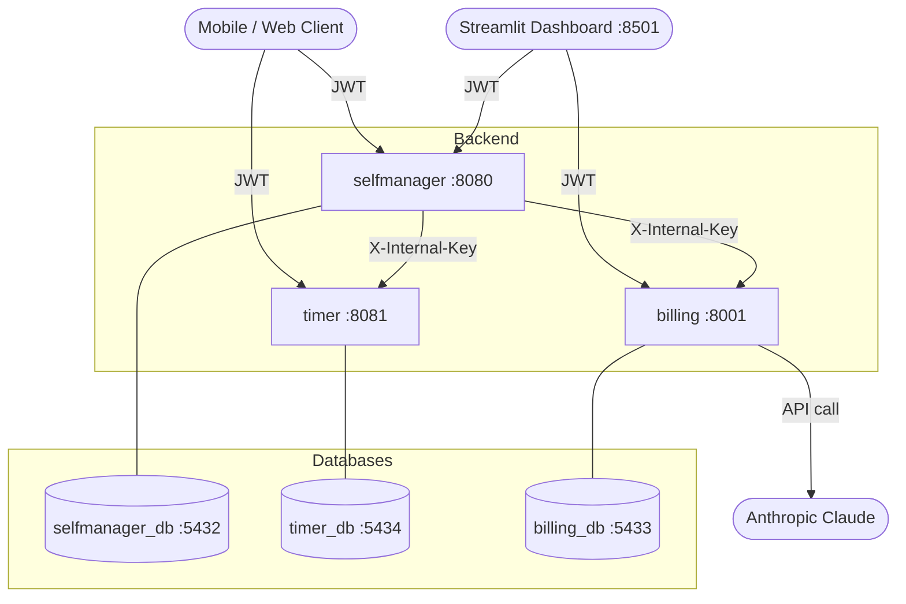
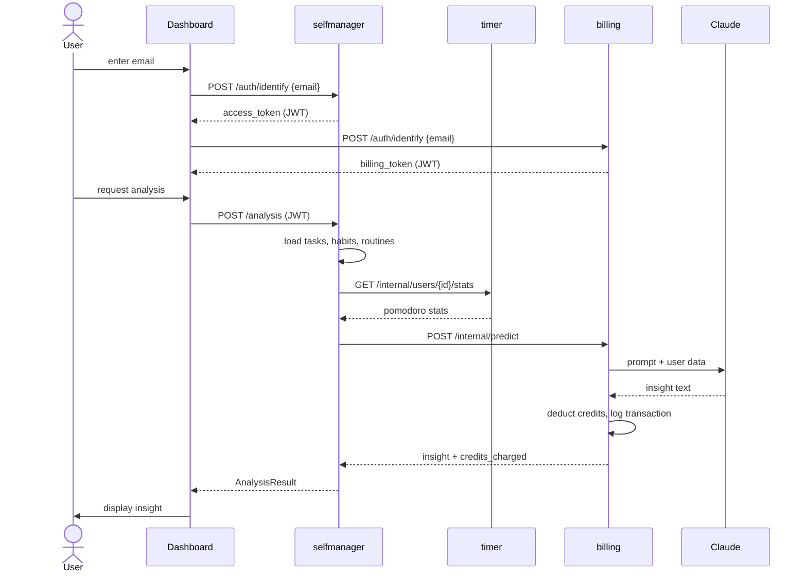

# ProductiveSocial — Architecture Overview

## What it does

Users track their work (tasks, habits, routines, focus sessions), and the system uses AI to analyze their productivity and charge credits for it.

---

## Services

### `psocial_selfmanager` (Kotlin/Ktor, port 8080)
The core service. Manages:
- **Users** — identified by email only, no password
- **Tasks** — with priority, time tracking, completion logs
- **Habits** — daily/weekly habits with type and recurrency
- **Routines** — structured routines with recurrency
- **Projects** — grouping of work

Also orchestrates AI analysis: gathers the user's data, fetches pomodoro stats from the timer, then sends it all to billing to run Claude.

### `psocial_timer` (Kotlin/Ktor, port 8081)
Pomodoro focus session tracker. Records work/break cycles linked to tasks or habits. Exposes an internal endpoint so selfmanager can pull per-user stats.

### `psocial_billing_service` (Python/FastAPI, port 8001)
Handles:
- **Credits** — users have a balance, AI calls cost credits
- **ML models** — register scikit-learn (`.pkl`) or LLM models
- **Predictions** — run sklearn inference or call Claude/OpenAI, deduct credits
- **Transactions** — full audit log of credit charges/refunds

### `psocial_dashboard` (Streamlit, port 8501)
Admin UI to interact with all services: login, run analyses, manage models, top up credits, view history.

---

## Authentication

### Client → Services (JWT)
- Login via `POST /api/v1/auth/identify` with email only
- Returns an access token + refresh token
- selfmanager and timer share the same JWT secret → one token works on both
- billing has its own JWT (separate user DB, separate UUIDs)
- Dashboard authenticates twice (once per service) and holds both tokens

### Service → Service (Internal Key)
- `X-Internal-Key` header with a shared secret
- Used for: selfmanager → timer, selfmanager → billing
- No JWT involved — simpler, no user context needed

---

## Data Flow — AI Analysis (end to end)

```
Dashboard
  └─ POST /api/v1/analysis  (JWT)
       └─ selfmanager
            ├─ loads tasks + habits + routines from its own DB
            ├─ GET /internal/users/{id}/stats  (X-Internal-Key)
            │    └─ timer → returns pomodoro session stats
            └─ POST /internal/predict  (X-Internal-Key)
                 └─ billing
                      ├─ loads model config
                      ├─ calls Claude (or OpenAI / sklearn)
                      ├─ deducts credits from user balance
                      ├─ logs transaction
                      └─ returns insight text + credits charged
  └─ Dashboard displays result
```

---

## Data Flow — Mermaid Diagram



---

## User Flow — Login & Analysis



---

## Databases

Each service owns its own PostgreSQL instance. No shared tables — services only communicate via HTTP.

| Service      | Database          | Port |
|--------------|-------------------|------|
| selfmanager  | psocial_selfmanager | 5432 |
| billing      | psocial_billing   | 5433 |
| timer        | psocial_timer     | 5434 |
