# ProductiveSocial — Architecture Diagrams

---

## 1. Overall System Architecture

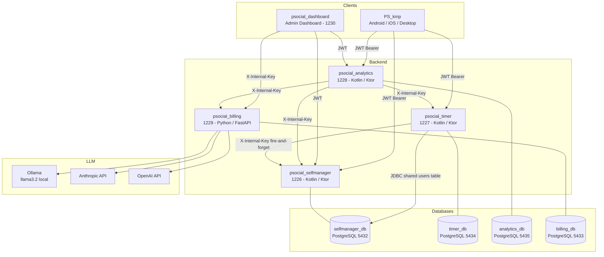

---

## 2. psocial_selfmanager - 1226

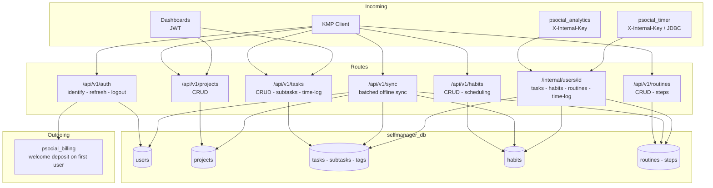

---

## 3. psocial_timer - 1227

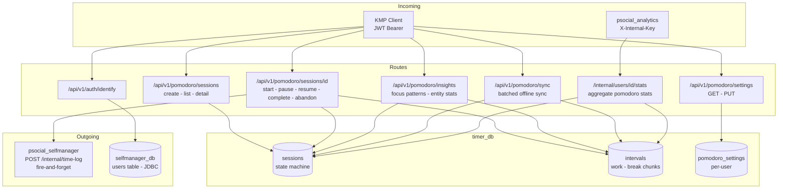

---

## 4. psocial_analytics - 1228

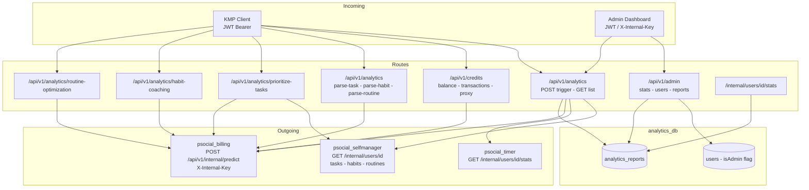

---

## 5. psocial_billing - 1229

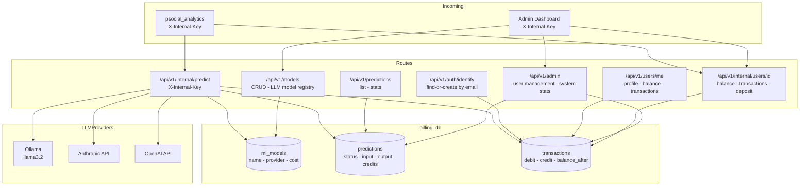

---

## 6. psocial_dashboard - Admin - 1230

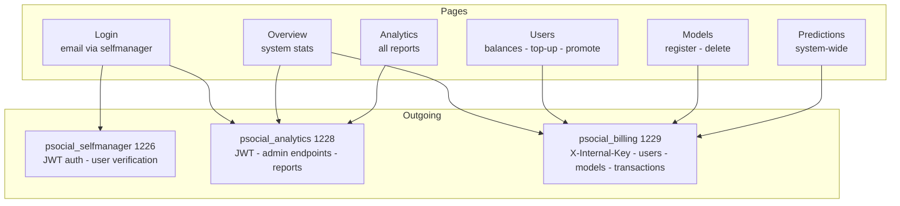

---

## 7. Authentication Flow (Client)

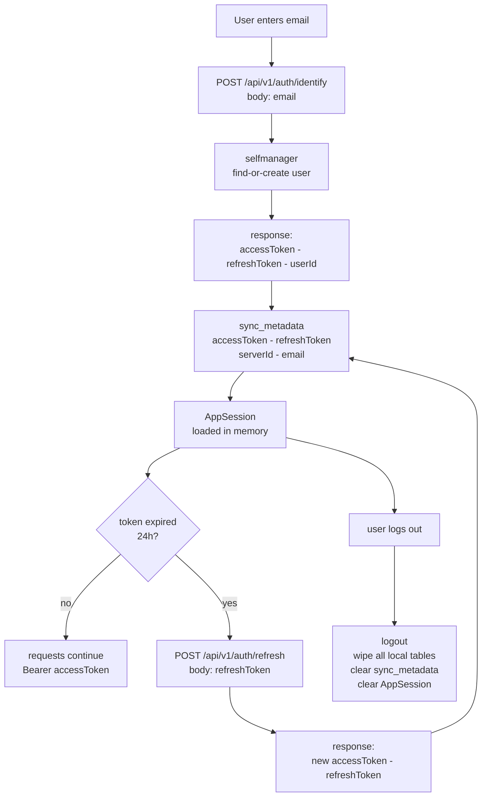

---

## 8. JWT Authentication Flow (Inter-Service)

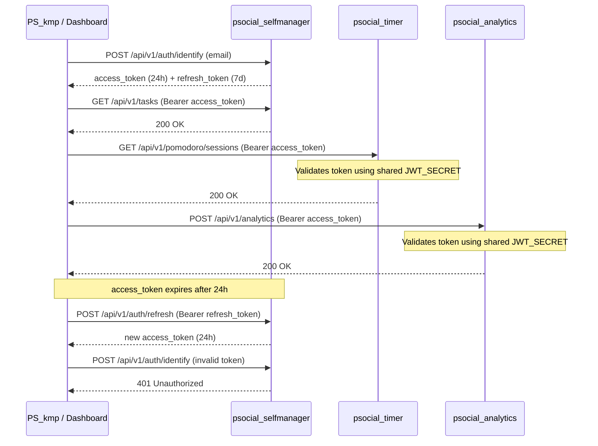

---

## 8. Project Flow

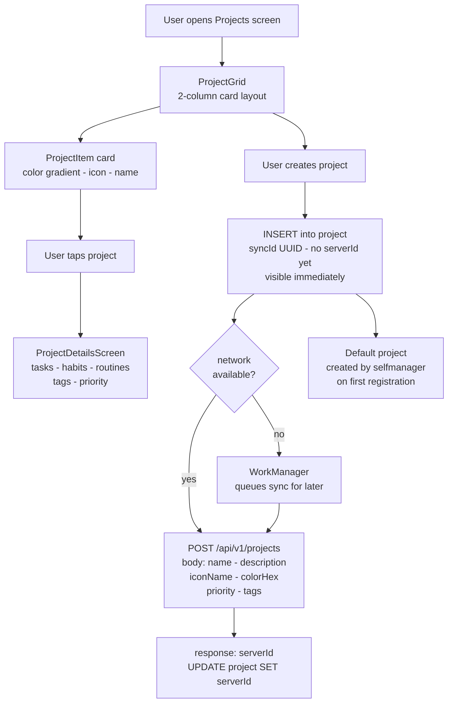

---

## 9. Offline Sync Flow

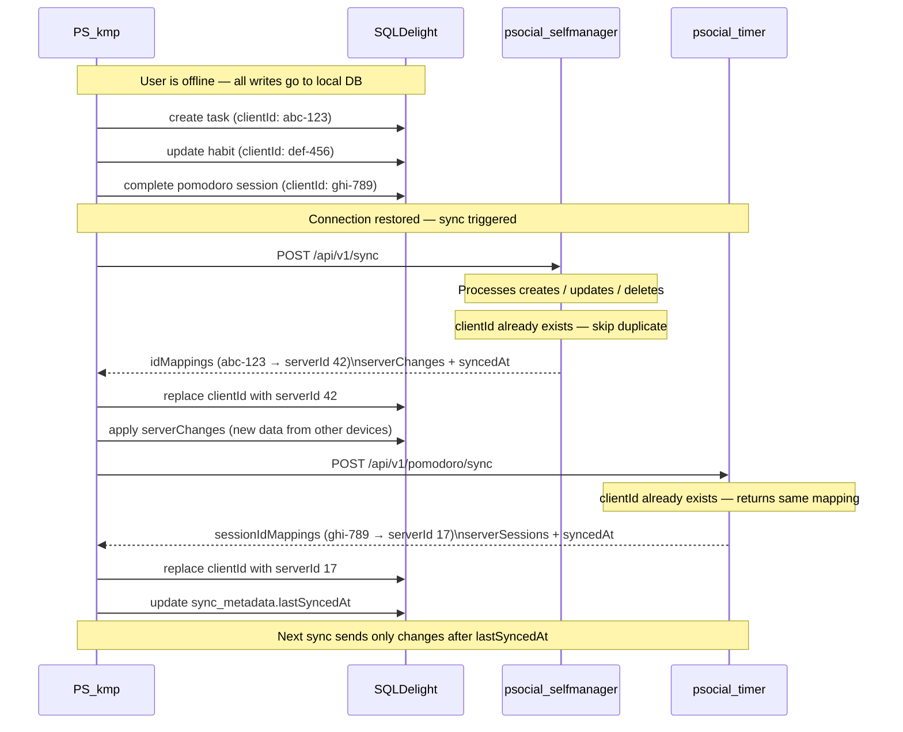

---

## 9. PS_kmp - KMP Client

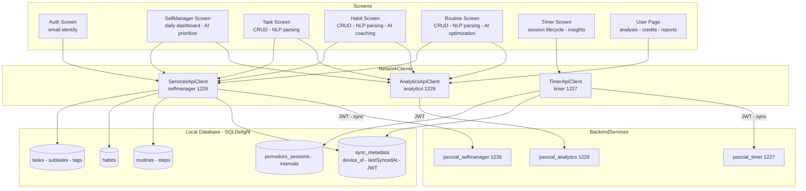

---

## 10. LLM Analysis Pipeline — 4-Step Flow (section 2.4)

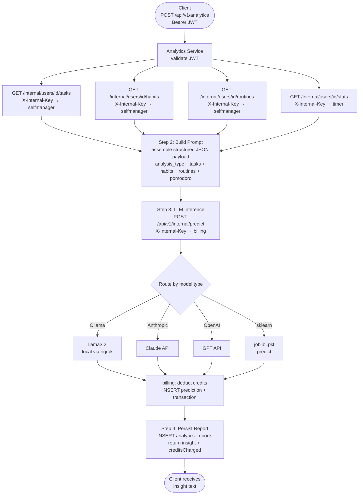

---

## 11. JWT Token Structure (section 2.2.6)

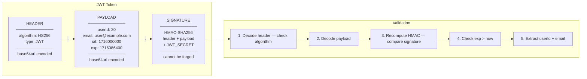

---

## 12. Production Deployment Architecture — Render + Neon + ngrok (section 3.11)

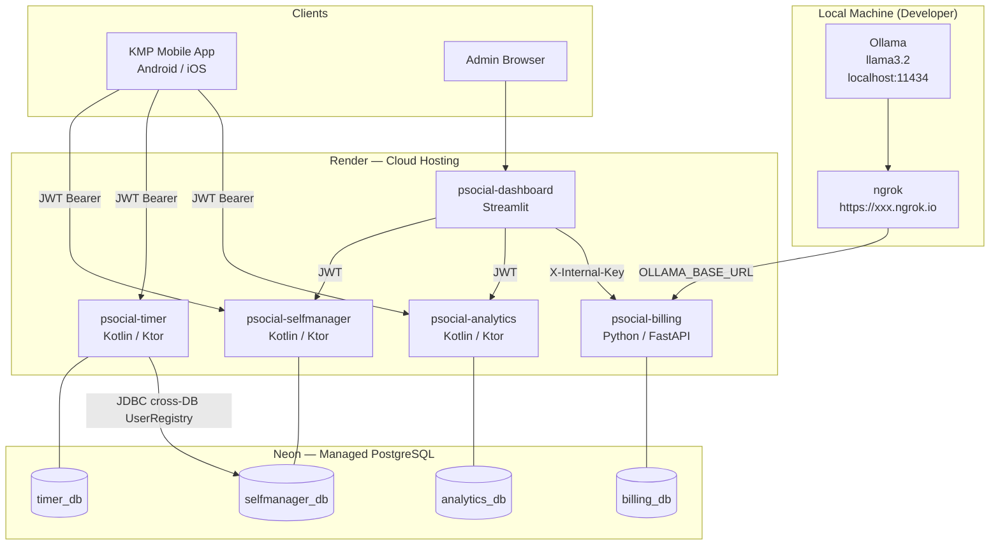

---

## 13. Local Development — Docker Compose Network (section 2.2.2)

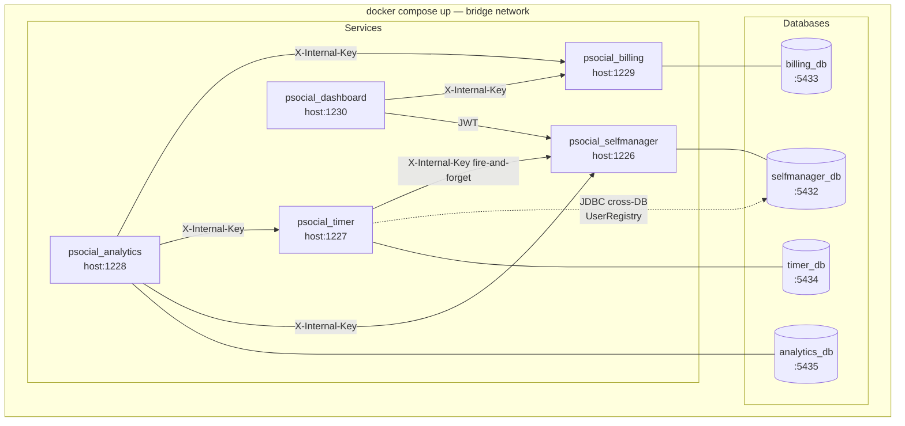

---

## 14. LLM vs Rule-based Baseline — Quality Scores (section 2.8)

```mermaid
xychart-beta
    title "LLM vs Rule-based Baseline — Expert Scores (1–5)"
    x-axis ["PRODUCTIVITY_SUMMARY", "HABIT_INSIGHTS", "WEEKLY_TIMER_SUMMARY"]
    y-axis "Score" 0 --> 5
    bar [1.5, 1.0, 1.5]
    bar [4.2, 3.9, 4.0]
```

*Bar 1 — Rule-based baseline. Bar 2 — LLM (Ollama llama3.2)*

---

## 15. Cold Start vs Warm Response Time (section 2.9)

```mermaid
xychart-beta
    title "Cold Start vs Warm Response Time by Service (seconds)"
    x-axis ["selfmanager (JVM)", "timer (JVM)", "analytics (JVM)", "billing (Python)"]
    y-axis "Seconds" 0 --> 60
    bar [52, 52, 52, 8]
    bar [1, 1, 1, 1]
```

*Bar 1 — cold start (after 15 min idle on Render free tier). Bar 2 — warm response*

---

## 16. Pomodoro Sessions by Entity Type — Production Data (section 2.1 / 3.6.9)

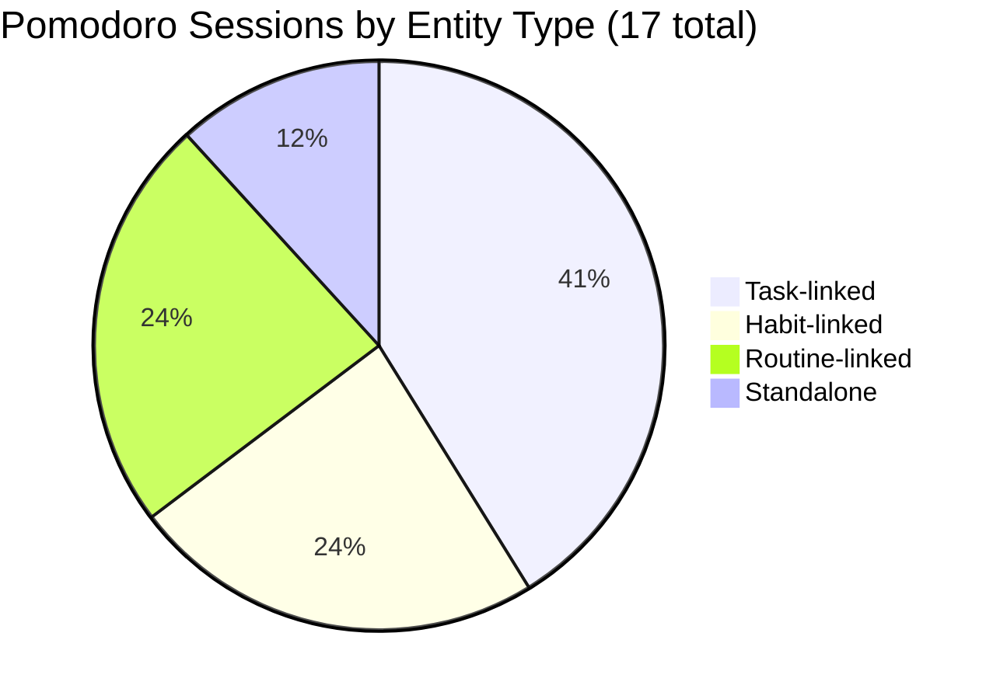

---

## 17. Focus Minutes by Entity Type — Production Data (section 2.1 / 3.6.9)

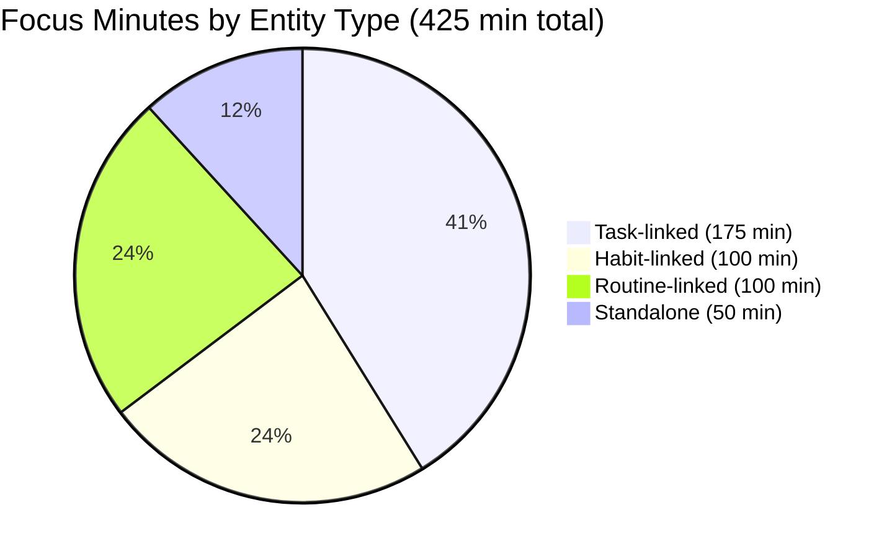

---

## 18. Task Completion by Priority — Production Data (section 2.1)

```mermaid
xychart-beta
    title "Test Dataset: Tasks by Priority and Completion Status"
    x-axis ["High", "Medium", "Low"]
    y-axis "Tasks" 0 --> 4
    bar [0, 2, 0]
    bar [3, 2, 1]
```

*Bar 1 — completed. Bar 2 — pending*

---

## 19. Habit Distribution by Type — Production Data (section 2.1 / 3.6.7)

```mermaid
pie title Habits by Type (6 total)
    "Start — building positive behaviour" : 5
    "Quit — breaking negative behaviour" : 1
```

---

## 20. Credit Balance Timeline — Production Data (section 2.8)

```mermaid
xychart-beta
    title "Credit Balance Over Testing Period (test@productivesocial.com)"
    x-axis ["Welcome +100", "After 20 charges", "Admin deposit +100", "After 1 charge", "Admin deposit +100", "After 16 charges", "Current"]
    y-axis "Credits" 0 --> 220
    line [100, 0, 100, 95, 195, 115, 115]
```

---

## 21. Локальная база данных KMP — ER-диаграмма (раздел 2.2.8)

```mermaid
erDiagram
    sync_metadata {
        TEXT key PK
        TEXT value
    }

    tag {
        INTEGER localId PK
        INTEGER serverId
        TEXT name
    }

    project {
        INTEGER localId PK
        INTEGER serverId
        TEXT syncId
        TEXT name
        TEXT description
        TEXT iconName
        TEXT colorHex
        TEXT priority
        INTEGER createdAt
        INTEGER updatedAt
        INTEGER isDeleted
    }

    project_tag {
        INTEGER projectLocalId FK
        INTEGER tagLocalId FK
    }

    task {
        INTEGER localId PK
        INTEGER serverId
        TEXT syncId
        INTEGER projectLocalId FK
        TEXT name
        TEXT description
        TEXT priority
        TEXT urgency
        INTEGER recurring
        INTEGER sendReminder
        INTEGER date
        TEXT target
        INTEGER completed
        INTEGER timeSpentMinutes
        INTEGER createdAt
        INTEGER updatedAt
        INTEGER isDeleted
    }

    task_time {
        INTEGER id PK
        INTEGER taskLocalId FK
        TEXT time
    }

    task_reminder {
        INTEGER id PK
        INTEGER taskLocalId FK
        TEXT option
    }

    task_tag {
        INTEGER taskLocalId FK
        INTEGER tagLocalId FK
    }

    subtask {
        INTEGER localId PK
        INTEGER serverId
        TEXT syncId
        INTEGER taskLocalId FK
        TEXT name
        INTEGER completed
        INTEGER timeSpentMinutes
        INTEGER isDeleted
    }

    habit {
        INTEGER localId PK
        INTEGER serverId
        TEXT syncId
        INTEGER projectLocalId FK
        TEXT name
        TEXT description
        TEXT habitType
        TEXT recurrency
        TEXT target
        INTEGER sendReminder
        INTEGER completed
        INTEGER timeSpentMinutes
        INTEGER createdAt
        INTEGER updatedAt
        INTEGER isDeleted
    }

    habit_time {
        INTEGER id PK
        INTEGER habitLocalId FK
        TEXT time
    }

    habit_reminder_time {
        INTEGER id PK
        INTEGER habitLocalId FK
        TEXT time
    }

    habit_tag {
        INTEGER habitLocalId FK
        INTEGER tagLocalId FK
    }

    habit_subtask {
        INTEGER localId PK
        INTEGER serverId
        TEXT syncId
        INTEGER habitLocalId FK
        TEXT name
        INTEGER completed
        INTEGER timeSpentMinutes
        INTEGER isDeleted
    }

    habit_completion {
        INTEGER id PK
        INTEGER habitLocalId FK
        TEXT completedDate
        INTEGER serverCompletionId
        TEXT syncId
        INTEGER deleted
    }

    routine {
        INTEGER localId PK
        INTEGER serverId
        TEXT syncId
        INTEGER projectLocalId FK
        TEXT name
        TEXT description
        TEXT recurrency
        TEXT target
        INTEGER sendReminder
        INTEGER completed
        INTEGER createdAt
        INTEGER updatedAt
        INTEGER isDeleted
    }

    routine_time {
        INTEGER id PK
        INTEGER routineLocalId FK
        TEXT time
    }

    routine_off_time {
        INTEGER id PK
        INTEGER routineLocalId FK
        TEXT time
    }

    routine_reminder_time {
        INTEGER id PK
        INTEGER routineLocalId FK
        TEXT time
    }

    routine_tag {
        INTEGER routineLocalId FK
        INTEGER tagLocalId FK
    }

    routine_step {
        INTEGER localId PK
        INTEGER serverId
        TEXT syncId
        INTEGER routineLocalId FK
        TEXT name
        TEXT description
        INTEGER autoStart
        INTEGER durationMinutes
        INTEGER position
        INTEGER completed
        INTEGER isDeleted
    }

    routine_completion {
        INTEGER localId PK
        INTEGER routineLocalId FK
        TEXT completedDate
        TEXT syncId
    }

    pomodoro_settings {
        INTEGER localId PK
        INTEGER serverId
        INTEGER workDurationMinutes
        INTEGER shortBreakMinutes
        INTEGER longBreakMinutes
        INTEGER cyclesUntilLongBreak
        INTEGER autoStartBreaks
        INTEGER autoStartSession
        INTEGER focusModeEnabled
        INTEGER soundEnabled
        INTEGER notificationsEnabled
    }

    pomodoro_session {
        INTEGER localId PK
        INTEGER serverId
        TEXT syncId
        INTEGER userId
        TEXT entityType
        INTEGER entityLocalId
        INTEGER entityServerId
        TEXT status
        INTEGER workDurationMinutes
        INTEGER shortBreakMinutes
        INTEGER longBreakMinutes
        INTEGER cyclesUntilLongBreak
        INTEGER completedCycles
        INTEGER totalWorkMinutes
        INTEGER startedAt
        INTEGER completedAt
    }

    pomodoro_interval {
        INTEGER localId PK
        INTEGER serverId
        TEXT syncId
        INTEGER sessionLocalId FK
        TEXT type
        INTEGER plannedDurationMinutes
        INTEGER startedAt
        INTEGER endedAt
        INTEGER completed
    }

    project ||--o{ task : "содержит"
    project ||--o{ habit : "содержит"
    project ||--o{ routine : "содержит"
    project ||--o{ project_tag : "тегируется"
    tag ||--o{ project_tag : ""
    tag ||--o{ task_tag : ""
    tag ||--o{ habit_tag : ""
    tag ||--o{ routine_tag : ""
    task ||--o{ task_time : "расписание"
    task ||--o{ task_reminder : "напоминание"
    task ||--o{ task_tag : "тегируется"
    task ||--o{ subtask : "имеет"
    habit ||--o{ habit_time : "расписание"
    habit ||--o{ habit_reminder_time : "напоминание"
    habit ||--o{ habit_tag : "тегируется"
    habit ||--o{ habit_subtask : "имеет"
    habit ||--o{ habit_completion : "выполнено в дату"
    routine ||--o{ routine_time : "расписание"
    routine ||--o{ routine_off_time : "время завершения"
    routine ||--o{ routine_reminder_time : "напоминание"
    routine ||--o{ routine_tag : "тегируется"
    routine ||--o{ routine_step : "имеет шаги"
    routine ||--o{ routine_completion : "выполнено в дату"
    pomodoro_session ||--o{ pomodoro_interval : "содержит"
```

**Рисунок 2.X. ER-диаграмма локальной SQLite базы данных клиентского приложения (25 таблиц).**

---

## 22. Ollama + ngrok: маршрут вывода LLM (разделы 2.2.10–2.2.11)

```mermaid
flowchart TD
    User([Пользователь\nзапускает анализ])

    subgraph KMP ["Мобильное приложение (KMP)"]
        App[AnalyticsScreen]
    end

    subgraph Render ["Render (облако)"]
        Billing["psocial_billing\nFastAPI · порт 1229"]
    end

    subgraph ngrok_cloud ["Инфраструктура ngrok"]
        NgrokEdge["ngrok Edge\nhttps://xxxx.ngrok-free.app"]
    end

    subgraph Dev ["Машина разработчика (localhost)"]
        NgrokAgent["ngrok agent\n→ localhost:11434"]
        Ollama["Ollama\nlocalhost:11434"]
        Model["llama3.2 (3B)\nлокальная модель"]
    end

    User --> App
    App -->|"POST /api/v1/analytics/analyze"| Billing

    Billing -->|"OLLAMA_BASE_URL\nngrok-skip-browser-warning\nследование перенаправлениям"| NgrokEdge
    NgrokEdge -->|"зашифрованный туннель"| NgrokAgent
    NgrokAgent -->|"localhost:11434\n/api/generate"| Ollama
    Ollama --> Model
    Model -->|"ответ LLM"| Ollama
    Ollama -->|"JSON stream"| NgrokAgent
    NgrokAgent --> NgrokEdge
    NgrokEdge -->|"HTTP ответ"| Billing
    Billing -->|"аналитический отчёт"| App
    App --> User

    style Dev fill:#f0f4ff,stroke:#4a6cf7
    style Render fill:#fff4e6,stroke:#f59e0b
    style ngrok_cloud fill:#f0fff4,stroke:#10b981
    style KMP fill:#fdf4ff,stroke:#a855f7
```

**Рисунок 2.X. Маршрут запроса на вывод LLM: от пользователя через облако до локального Ollama через туннель ngrok.**

---

## 23. NLP-разбор пользовательского ввода — поток (раздел 2.6)

```mermaid
flowchart TD
    A([Пользователь нажимает\n«Ввод на естественном языке»])
    B["checkModelStatus()\n→ аналитическая служба"]

    B --> C{Модель доступна?}
    C -- "null" --> D["Отображается «Checking…»"]
    D --> B
    C -- "false" --> E["Отображается «AI model is unavailable»\n+ кнопка «Retry»"]
    E -- "Retry" --> B
    C -- "true" --> F["Отображается текстовое поле\n+ кнопка «Generate»"]

    A --> B

    F --> G([Пользователь вводит\nпроизвольный текст])
    G --> H["Запрос отправляется в\nAnalyticsApiClient\nparseTask() / parseHabit() / parseRoutine()"]

    H --> I["Аналитическая служба\n→ LLM-вывод\n→ структурированный JSON"]

    I --> J{Тип сущности}

    J -- "Задача / Привычка" --> K["Карточка предпросмотра:\nназвание, дата, время, приоритет,\nнапоминание, теги, проект, подзадачи"]
    J -- "Рутин" --> L["Карточка предпросмотра:\nназвание, шаги с длительностью\nи флагом autoStart, рекуррентность"]

    K --> M{Пользователь проверяет}
    L --> M

    M -- "Применить" --> N["Данные переносятся в форму создания\n→ пользователь сохраняет"]
    M -- "Отменить" --> G

    N --> O([Сущность сохранена\nв локальной БД и синхронизирована])

    style D fill:#fff3cd,stroke:#f59e0b
    style E fill:#fee2e2,stroke:#ef4444
    style F fill:#dcfce7,stroke:#22c55e
    style O fill:#dbeafe,stroke:#3b82f6
```

**Рисунок 2.X. Поток NLP-разбора пользовательского ввода при создании задачи, привычки или рутина.**
